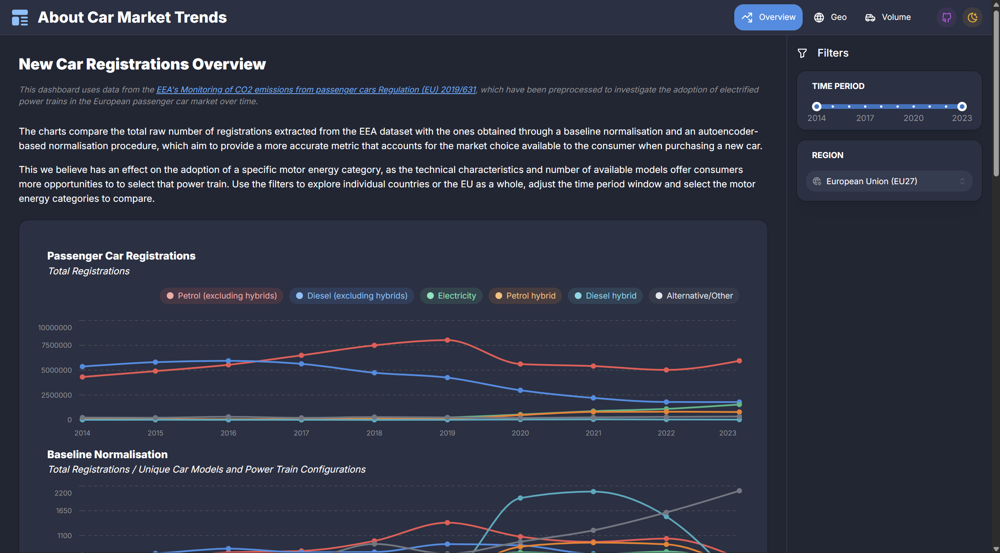
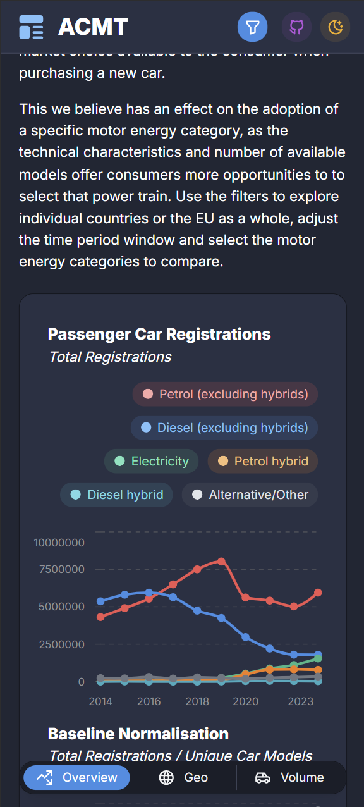

<div align="center">


<h1 style="font-weight: 900;">About Car Market Trends</h1>

Developed by Gianluca Rigatti and Giuseppe Screnci for the *Data Visualisation Lab* course.


</div>

## 🌱🚗 About the Project

This project aims to develop a data visualisation solution for exploring the evolution of new passenger car registrations in Europe, with a particular focus on the transition towards more sustainable power train technologies.

The project includes the data preprocessing and validation steps applied to the [EEA's *Monitoring of CO2 emissions from passenger cars Regulation (EU) 2019/631*](https://www.eea.europa.eu/en/datahub/datahubitem-view/fa8b1229-3db6-495d-b18e-9c9b3267c02b) dataset used to support the development of an interactive dashboard.

The central question guiding our analysis is:
>"Is the observed increase in electrified vehicles driven by genuine growth in demand, national incentives and taxation rules, or is it largely a consequence of the decline in petrol and diesel vehicle offerings?"

<div align="center">

  
  &nbsp;&nbsp;&nbsp;
  

</div>

> [!TIP]
> **🚀 TL;DR - Run with Docker**
>
> ```bash
> docker build -t my-dashboard .
> docker run -p 8050:8050 my-dashboard
> ```
>
> Open **http://localhost:8050** in your browser.
> See [`📄 dashboard/README.md`](dashboard/README.md) for detailed instructions and the Python virtual environment setup.

## 📂 Repository Structure

> [!IMPORTANT]
> See [`📄 dashboard/README.md`](dashboard/README.md) for instructions on running the dashboard and [`📄 technical_report/README.md`](technical_report/README.md) for informations on the preprocessing steps and analyses carried out for the technical report deliverable.

```text
.
├── 📂 assets/              # Assets for the repo
├── 📂 dashboard/           # Source code for the dashboard
│   └── 📄 README.md
├── 📂 data/                # Raw datasets
│   └── 📂 cleaned/         # Preprocessed datasets
├── 📂 docs/                # Deliverables [.pdf]
├── 📂 technical_report/    # Preprocessing and analysis scripts
│   └── 📄 README.md
└── 📄 README.md
```