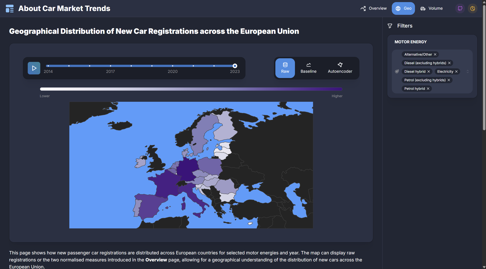
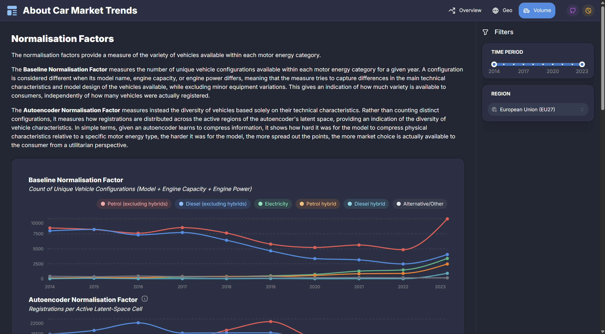
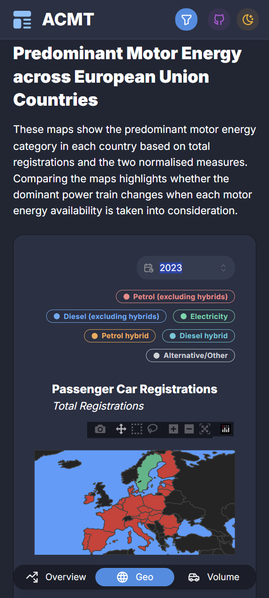
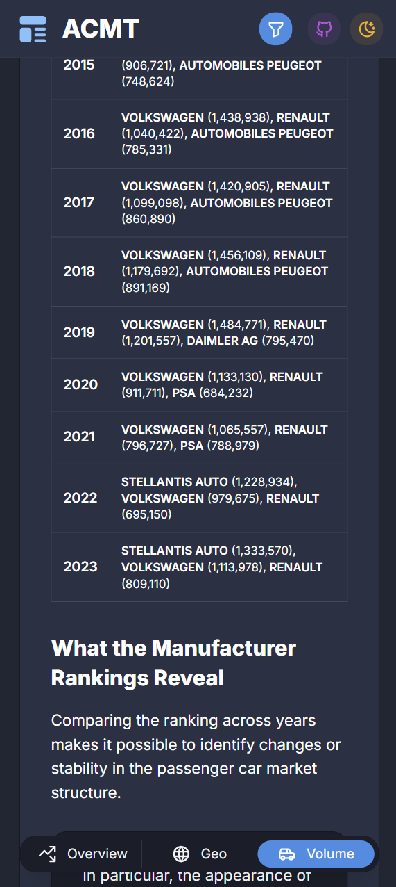

# Dashboard

This directory contains the source code for the interactive dashboard developed to explore the evolution of new passenger car registrations in Europe.

The **About Car Market Trends** dashboard provides visualisations for vehicle registrations, manufacturer rankings, available vehicle choice and a geographical view.

## 📊 Preview

<div align="center">

<table>
  <tr>
    <td align="center">
      
    </td>
    <td align="center">
      
    </td>
    <td align="center">
      
    </td>
  </tr>
  <tr>
    <td align="center">
      <sub><b>Desktop, Overview</b></sub>
    </td>
    <td align="center">
      <sub><b>Desktop, Geo</b></sub>
    </td>
    <td align="center">
      <sub><b>Desktop, Volume</b></sub>
    </td>
  </tr>
  <tr>
    <td align="center">
      
    </td>
    <td align="center">
      
    </td>
    <td align="center">
      
    </td>
  </tr>
  <tr>
    <td align="center">
      <sub><b>Mobile, Overview</b></sub>
    </td>
    <td align="center">
      <sub><b>Mobile, Geo</b></sub>
    </td>
    <td align="center">
      <sub><b>Mobile, Volume</b></sub>
    </td>
  </tr>
</table>

</div>

## 🚀 Running

This dashboard can be run either using Docker or a standard Python virtual environment. 

> [!IMPORTANT]
> The complete dashboard with the necessary files is contained in the current `dashboard/` folder, whereas the `requirements.txt` and the `Dockerfile` are in the repository root.

### 🐳 Running with Docker

From the **repository root**, build the Docker image:

```bash
docker build -t my-dashboard .
```

Run the dashboard:

```bash
docker run -p 8050:8050 my-dashboard
```

The dashboard will be available at:

```text
http://localhost:8050
```

To run it in the background:

```bash
docker run -d -p 8050:8050 --name my-dashboard my-dashboard
```

Stop the dashboard with:

```bash
docker stop my-dashboard
```

### 🐍 Running with a Python Virtual Environment

From the **repository root**, create a virtual environment:

```bash
python3 -m venv .venv
```

Activate it:

**Linux / macOS:**

```bash
source .venv/bin/activate
```

**Windows:**

```powershell
.venv\Scripts\activate
```

Install the requirements:

```bash
pip install -r requirements.txt
```

Then start the dashboard:

```bash
cd dashboard
python app.py
```

The dashboard will be available at:

```text
http://localhost:8050
```

When finished, you can deactivate the virtual environment with:

```bash
deactivate
```
